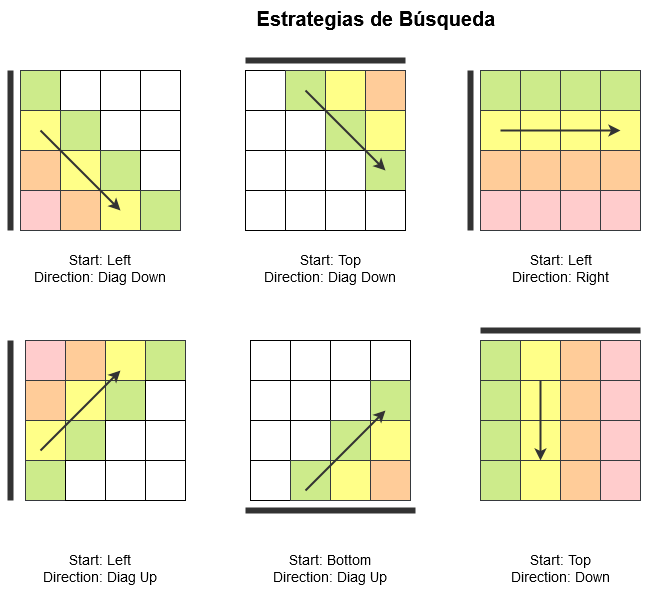

# Desafío de Mercado Libre

Autor: Pablo Giudice

[](https://travis-ci.org/pgiu/mutante)


## Objetivo

El objetivo de la aplicación es detectar si cierta matriz de ADN corresponde al de un humano o al de un mutante. 

Una matriz de ADN tiene una forma como la siguiente: 

````
CGTG
GTAG
GGTT
ATTT
````

Se dice que el ADN es de un mutante si posee más de una secuencia de 4 caracteres iguales (A, C, G, T).

## Algoritmo de Búsqueda

El algoritmo se encarga de buscar al menos dos secuencias de caracteres iguales, de largo 4.

En esencia, son 4 for loops (todas las direcciones posibles) pero para evitar reescribir 4 bloques muy similares, usé una clase `DnaIterator ` que se encarga de esconder la complejidad del manejo de indices (que son diferentes en cada caso). 

```java
int searchUsingStrategy(String[] dna, Start startDimension, Direction direction, int curCount) {

    DnaIterator di = new DnaIterator(dna, startDimension, direction);
    int sequenceCount = 0;

    do {
        int counter = 1;
        Character prevChar = di.getValue();

        Character curChar;
        while ((curChar = di.getNext(direction)) != null) {

            if (curChar.equals(prevChar)) {
                counter++;
            } else {
                prevChar = curChar;
                counter = 1;
            }

            if (counter == SEQUENCE_LENGTH) {
                sequenceCount++;
                if (curCount + sequenceCount >= 2) {
                    return sequenceCount;
                }
                // Reiniciamos la búsqueda y consumimos un valor dummy
                counter = 1;
                di.getNext(direction);
                prevChar = di.getNext(direction);
            }
        }
    } while (di.nextStartDimension(startDimension));

    return sequenceCount;
}
```

La función se llama entonces con todas las combinaciones posibles de `startDimension` y `direction`.

A continuación, un diagrama de las posibles búsquedas. Los casos de búsqueda vertical y horizontal son los más fáciles. Para los de búsqueda diagonal (hacia arriba y abajo) opté por desdoblarlas en dos búsquedas. Por ejemplo, para cubrir la diagonal hacia abajo, uno puede empezar por el lateral izquierdo (left) o el superior (top). Es importante manejar bien los índices para no contar dos veces la diagonal.




## Descripción del servidor REST

El proyecto contiene un servidor web REST basado en Spring Boot. 

Los mensajes que procesa son dos: 

- POST /mutant , que recibe un json como el siguiente

   ````
   {
       "dna" : ["AAAA", "ATCG", "GTCA", "GGGG"]
   }
   ````

- GET /stats , que devuelve un json de la forma: 

  ````
  {
      "count_mutant_dna":40, 
      "count_human_dna":100: 
      "ratio":0.4
  }
  ````

  

Para probar el funcionamiento, se puede usar CURL, postman o cualquier otra herramienta. 

También incluí una interfaz web que se puede acceder localmente o via el servidor en AWS. 


## Como probarlo

Hay una versión de prueba alojada en AWS. 

La URL es http://mutanteapp-env.ypighmykyw.us-west-1.elasticbeanstalk.com

Configuración del servidor en la nube: 

- Elastic Beanstalk
  - **t1.micro**. Optimo para picos de carga. Según Amazon: We allow the instance to operate at up to 2 EC2 compute units (ECUs) (one ECU provides the equivalent CPU capacity of a 1.0-1.2 GHz 2007 Opteron or 2007 Xeon processor). 
  - **Sin load balancer** No está en el Free Tier :( 
- Base de datos: 
  - MySQL en db.t2.micro (Amazon RDS)


## Escalabilidad

Hice pruebas usando www.loader.io y logré servir hasta 1000 peticiones por minuto. Al intentar elevar el número a 10k peticiones, el numero de timeouts de red hace que los tests falle. La forma de solucionar esto es:

- incrementar el poder de cómputo de las [instancias](https://aws.amazon.com/ec2/instance-types/) (large/xlarge) 
- agregar más instancias (y un load balancer)
- crear workers para la escritura a la base de datos.


## Compilar el código fuente 

En este repo se encuentra el código fuente del proyecto. Para compilarlo y correr los tests automáticos, ejecutar las siguientes líneas.

````
mvn 
cd target
java -jar mutante-app-0.1.0.jar
````


## Consideraciones

- El tamaño máximo de la matriz de ADN es 1000x1000.

- El algoritmo de búsqueda es simple pero permite paralelizar fácilmente. Pueden usarse threds distintos para hacer búsquedas en direcciones distintas. Esto permitiría multiplicar por 6 la performance. 

- El algoritmo no hace copias de la matriz de entrada, por lo que es óptimo desde el punto de vista de memoria. 

- En el peor caso (no hay cadenas mutantes) hay que recorrer la totalidad de la matriz 4 veces (una por cada dirección: horizontal, vertical, diagonal arriba-abajo, diagonal abajo-arriba). 

  Por lo tanto, desde el punto de vista de tiempo de ejecución, es lineal con el tamaño de la matriz de entrada (N = nxn).

- Para casos más extremos, podría considerarse asignar un thread a cada fila, columna o diagonal. Esto permitiría, en teoría, buscar N veces más rápido, pero no tiene en cuenta el costo de iniciar N threads.

  

  